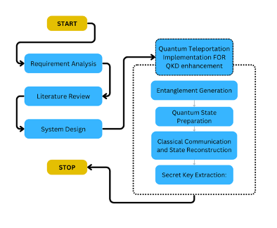

#Quantum-Leap
This Quantum Key Distribution [1] is a method of securely sharing cryptographic keys between two nodes, consider Alice and Bob, through the application of quantum mechanical concepts. In contrast to the classical cryptographic techniques which depend on the computational complexity of certain mathematical problems and could be susceptible to breakthroughs, Quantum Key Distribution (QKD) are based on quantum mechanics principles, which makes it theoretically impossible for an eavesdropper, like Eve, to intercept the key without any detection. Based on the quantum mechanics fundamentals, QKD provides unconditional security. Encoding information in quantum states, typically photons, this protocol allows Alice and Bob to generate secret keys that are immune to eavesdropping attempts, providing a high level of security for communication.
However, there is one significant challenge this system faces. The attenuation of quantum signals over long distances, particularly when transmitted through optical fibers [1].  This attenuation restricts the range of the system and poses obstacles to the establishment of large-scale quantum communication networks. Additionally, maintaining entanglement between distant qubits, which is important for QKD protocols, can be challenging due to environmental factors and noise. Hence, this paper showcases a novel quantum communication protocol determined from the principles of quantum teleportation. This protocol aims to enable secure transmission of quantum information over large distances by using quantum entanglement and classical communication channels.
By integrating quantum teleportation principles in QKD protocols, it becomes possible to extend the range of quantum communication networks and enhance security against eavesdropping[3]. Quantum teleportation, is a phenomenon in quantum mechanics where the state of a quantum system can be transmitted from one location to another without involving the system to move physically [2]. By utilizing entanglement between particles, quantum teleportation enables to transfer quantum information over long distances while preserving the security of the transmitted quantum state. This makes the protocol an attractive tool to overcome the limitations of traditional QKD systems. 
This research paper addresses the limitations in quantum communication such as vulnerability, enhancing security, efficiency, scalability of quantum communication. This paving a way for the development of secure communication networks in the quantum era.
This paper involves a comprehensive investigation through Qiskit implementation on how the proposed quantum protocol performs in comparison to the traditionally existing protocols like BB84 , E91 and others.  By utilizing Qiskit, a versatile quantum computing framework, one can simulate and analyse the behaviour of the protocol under various conditions and configurations [5]. This includes detailed experimentation to evaluate the protocol’s performance metrics, such as QBER (Quantum Bit Error Rate) and key generation rate across different simulation scenarios [4] [6] [7]. This allows researchers to explore strategies and fine-tune the protocol’s parameters to enhance its performance and security [5].
To mention in a summarized format, this research :
•	Enhance security: Develop a QKD system with enhanced resilience against eavesdropping using quantum teleportation and machine learning.
•	Increase communication distance: Utilize teleportation to overcome distance limitations and achieve longer key distribution range.
•	Optimize performance: Integrate machine learning for real-time anomaly detection, adaptive basis selection, and improved error correction.
•	Security analysis: Conduct thorough analysis against known and future eavesdropping techniques, identifying vulnerabilities and optimizing system parameters for enhanced security.

